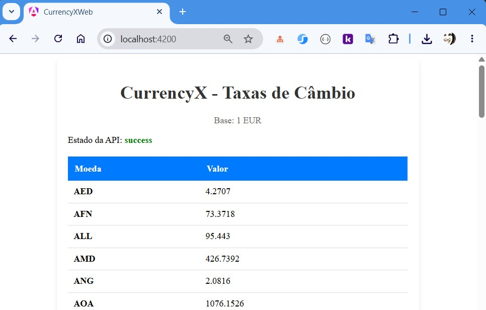
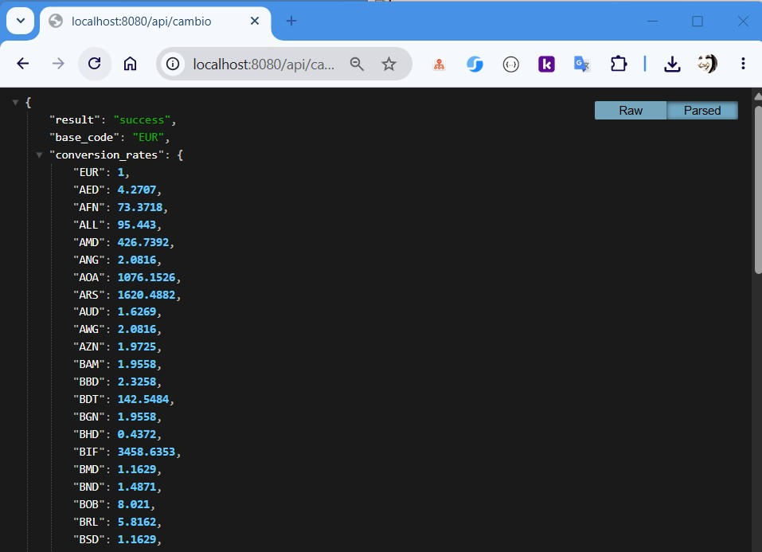

# 💱 CurrencyX - Full Stack Dashboard

This project was a purely technical Proof of Concept (PoC) aimed at validating modern reactivity and architectural patterns currently trending in the industry.

🔹 **Backend (Java 21):**
Clean implementation focusing on the efficiency of the language's latest features (such as Records).
Robust and seamless integration with external financial data providers.

🔹 **Frontend (Angular 18):**
Deep dive into the new Reactive Control Flow and optimized performance.
A clean, functional UI designed for real-time data delivery and better UX.

---
<table border="0">
  <tr>
    <td valign="top" align="center" width="50%">
      <p align="center"><b>Frontend Dashboard</b></p>
      
    </td>
    <td valign="top" align="center" width="50%">
      <p align="center"><b>Backend JSON API</b></p>
      
    </td>
  </tr>
</table>


## 🛠️ Technologies and Concepts Used

### **Backend (API)**
* **Java 21:** Utilization of Records for an immutable and concise data structure.
* **Spring Boot 3.x:** Base framework for creating the REST API.
* **Maven:** Dependency management and project build.
* **RestTemplate:** Integration and consumption of third-party API (ExchangeRate-API).
* **Externalized Configuration:** API key management via environment variables and @Value.
* **CORS Configuration:** Security configuration to allow communication with the Frontend.

### **Frontend (Web)**
* **Angular 18:** Modern framework using Standalone Components.
* **TypeScript:** Typed programming for increased security and scalability.
* **HttpClient:** Asynchronous consumption of Backend resources.
* **RxJS:** Utilization of Observables for data stream subscriptions.
* **CSS Flexbox/Grid:** Clean, responsive interface focused on User Experience (UX).

---

## ⚙️ How to run the project locally

### Prerequisites
*   JDK 21 installed
*   Maven 3.9+ installed
*   Node.js (LTS) and Angular CLI installed

### 1. Clone the repository
```bash
git clone https://github.com/reafreitas1/currency_x_fullstack.git
cd currency_x_fullstack
```

### 2. Setup and run the Backend (Java)
1. Obtain a free key at exchangerate-api.com.
2. In the file currency_x_api/src/main/resources/application.properties, add your key:
api.exchangerate.key=YOUR_KEY_HERE
3. In IntelliJ or your terminal:
```bash
cd currency_x_api
mvn spring-boot:run
```
### 3. Setup and run the Frontend (Angular)
1. Open a new terminal in the project folder:
```bash
cd currency-x-web
npm install
ng serve
```
2. Access a http://localhost:4200 in your browser.

### 👩👩‍💻 About Me
* **LinkedIn:** linkedin.com/in/reafreitas1/
* **GitHub:** github.com/reafreitas1
* **Location:** Porto, Portugal
